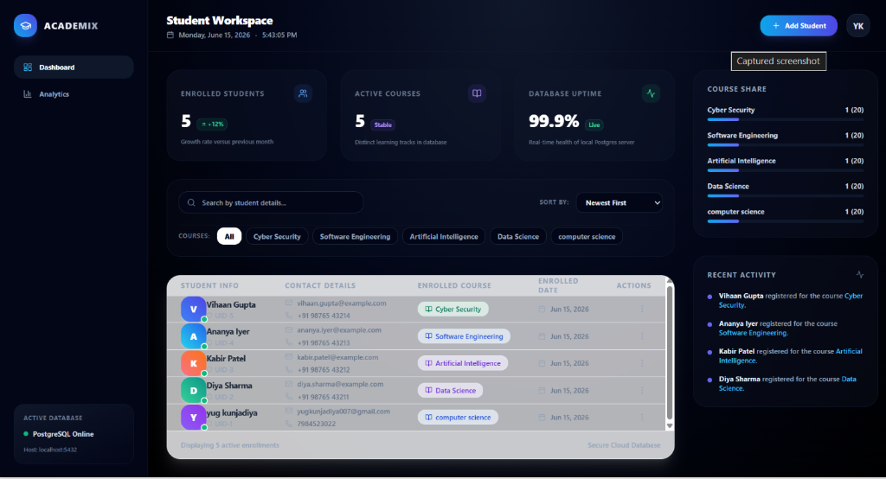
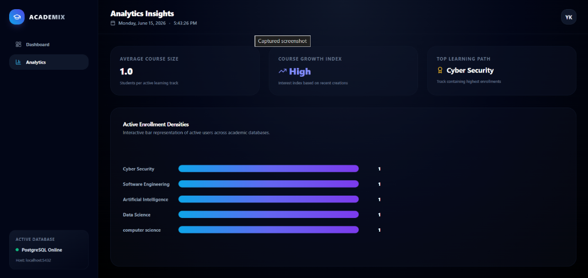

# 🎓 Academix — Student Management SaaS Dashboard

Academix is a premium, state-of-the-art Student Management CRM system designed with modern SaaS aesthetics and built on a robust full-stack architecture. Drawing inspiration from top-tier platforms like Linear, Stripe, and Vercel, it features a glassmorphism dark-mode UI, smooth micro-interactions, dynamic dashboard metrics, custom visualizations, and comprehensive database logs.

---

## 📸 Interface Preview

### 🖥️ Student Workspace (Dashboard)
The primary cockpit for managing student records. It features dynamic counters for enrolled students, active courses, and server uptime. It also lists students in a premium glassmorphic grid with custom badges, dynamic filter chips, search query capabilities, and a live Recent Activity feed.



### 📊 Analytics Insights
Provides key metrics at a glance, highlighting average course sizes, course growth trends, top learning pathways, and active student enrollment densities through interactive gradient bar representations.



---

## ✨ Features

- **Premium SaaS Aesthetic**: A sleek, dark-themed dashboard styled with HSL tailored color palettes, glassmorphism card layouts, subtle gradients, and smooth hover state animations (powered by Tailwind CSS and Framer Motion).
- **Comprehensive CRUD Operations**:
  - **Add Student**: Multi-field registration modal with validation (name, email, phone, course).
  - **View Students**: Paginated tabular layout with inline action triggers and personalized avatar badges.
  - **Update Student**: Pre-populated update forms with conflict validation (e.g., duplicate email checks).
  - **Delete Student**: Dialog box to prevent accidental record removals.
- **Real-Time Data Filtering**: Instant search and course-specific filter chips.
- **Dynamic Metrics**:
  - Growth trend indicators (`+12%`, `-5%`, etc.)
  - Real-time PostgreSQL database health/uptime indicator.
  - Interactive course share breakdown and recent registration activity feed.
- **Analytics View**: High-fidelity dashboard for tracking average course sizes, growth indices, top tracks, and active enrollment density charts.
- **Robust Backend**:
  - Built with Express and Node.js using clean Model-View-Controller architecture.
  - Secure parameterized queries via PostgreSQL (`pg` pool integration) to prevent SQL injection.
  - Custom error handling and input validation middleware.

---

## 🛠️ Tech Stack

### Frontend
- **Framework**: React 19 (Vite, TypeScript)
- **Styling**: Tailwind CSS
- **Animations**: Framer Motion
- **Icons**: Lucide React
- **API Client**: Axios

### Backend
- **Runtime**: Node.js
- **Framework**: Express.js
- **Database**: PostgreSQL
- **Orchestration**: Concurrently (runs frontend & backend together)

---

## 📁 Project Structure

```
Mini-Project-1/
├── backend/
│   ├── src/
│   │   ├── config/
│   │   │   └── db.js               # pg Pool setup
│   │   ├── controllers/
│   │   │   └── studentController.js # API Controllers & validator rules
│   │   ├── middleware/
│   │   │   └── errorMiddleware.js   # DB Error mapper
│   │   ├── models/
│   │   │   └── studentModel.js      # SQL queries & DB interaction
│   │   └── routes/
│   │       └── studentRoutes.js     # Route controllers mapping
│   ├── .env.example
│   ├── .env
│   ├── package.json
│   ├── schema.sql                   # Database setup script
│   └── server.js                    # Backend server entrypoint
│
├── frontend/
│   ├── src/
│   │   ├── components/
│   │   │   ├── Dashboard.tsx        # Dashboard layout, state & tabs
│   │   │   ├── DeleteModal.tsx      # Record deletion confirmation modal
│   │   │   ├── StudentForm.tsx      # Add/Edit validator form modal
│   │   │   └── StudentTable.tsx     # Custom records table
│   │   ├── services/
│   │   │   └── api.ts               # Axios services
│   │   ├── types/
│   │   │   └── student.ts           # TS Types
│   │   ├── App.tsx                  # Root wrapper
│   │   ├── index.css                # Base & tailwind configuration
│   │   └── main.tsx
│   ├── package.json
│   ├── postcss.config.js
│   ├── tailwind.config.js
│   └── vite.config.ts
│
├── docs/
│   ├── README.md                    # Project documentation
│   ├── architecture.md              # Technical design specifications
│   ├── api-documentation.md         # Express REST API endpoints list
│   └── prompts-used.md              # Redesign prompts history
│
└── screenshots/                     # Preview images
    ├── dashboard.png
    └── analytics.png
```

---

## 🚀 Getting Started

### Prerequisites
- **Node.js** (v18 or higher)
- **PostgreSQL** (running locally or in the cloud)

### 1. Database Setup
1. Log in to your PostgreSQL instance (e.g., via `psql` or pgAdmin).
2. Create the target database:
   ```sql
   CREATE DATABASE student_db;
   ```
3. Run the schema migrations from `backend/schema.sql` to construct the student table and seed sample records:
   ```bash
   psql -U postgres -d student_db -f backend/schema.sql
   ```

### 2. Environment Configuration
Navigate to the `backend/` directory, copy the `.env.example` file to `.env`, and update it with your database credentials:
```env
PORT=5000
DB_USER=postgres
DB_PASSWORD=your_password
DB_HOST=localhost
DB_PORT=5432
DB_NAME=student_db
```

### 3. Installation & Start

Academix includes a root-level task manager that allows you to install and launch both applications with single commands:

1. **Install all dependencies** (Frontend & Backend):
   ```bash
   npm run install:all
   ```
2. **Start the development servers**:
   ```bash
   npm run dev
   ```

The application will now be running on:
- **Frontend client**: [http://localhost:5173](http://localhost:5173)
- **Backend server API**: [http://localhost:5000](http://localhost:5000)

---

## 🔌 API Endpoints Summary

For complete details, see [api-documentation.md](file:///d:/ai-%20first%20engineer/Mini-Project-1/docs/api-documentation.md).

| Method | Endpoint | Description | Query Parameters |
| :--- | :--- | :--- | :--- |
| `GET` | `/api/students` | Retrieve all student records | `search` (optional search query) |
| `GET` | `/api/students/:id` | Get details for a single student | None |
| `POST` | `/api/students` | Register a new student | None (expects JSON body) |
| `PUT` | `/api/students/:id` | Update student credentials | None (expects JSON body) |
| `DELETE`| `/api/students/:id` | Remove a student's enrollment record | None |
