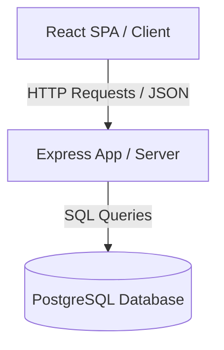
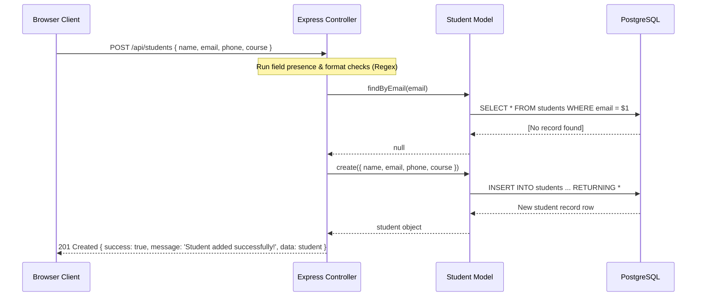

# Architecture & Design Document (Mini-Project-1)

This document describes the architectural layout, database structure, design choices, and system data flows for the **Student Management CRUD Application**.

---

## 1. System Overview
The application follows a decoupled **Client-Server Architecture**:
1. **Client (Frontend)**: React Single Page Application (SPA) built using Vite, TypeScript, and styled with Tailwind CSS. Communicates with the API server via Axios.
2. **Server (Backend)**: REST API built with Node.js and Express.js following Model-View-Controller (MVC) architectural design patterns.
3. **Database**: PostgreSQL relational database containing index-optimized tables.

---

## 2. Frontend Architecture
The frontend codebase prioritizes component reuse, strict TypeScript typing, and responsive layout guidelines:

- **Entry Point**: `App.tsx` renders the `Dashboard` container.
- **Components**:
  - `Dashboard.tsx`: State orchestrator. Manages statistics calculation, local notifications, modal states, and search queries (utilizing a 300ms debounce window to limit server load).
  - `StudentTable.tsx`: Pure rendering table component. Loops through array inputs and maps callback hooks for Edit/Delete click triggers. Supports loading spinners and empty states.
  - `StudentForm.tsx`: Dynamic form modal handles input state validation, prevents submission on errors, and maps input data directly to API calls.
  - `DeleteModal.tsx`: Soft safety dialog to confirm permanent API operations.
- **Service Layer**:
  - `src/services/api.ts`: Central Axios setup with base URL configuration, exporting async calls matching each REST endpoint.
- **State Flow**:
  - React handles all state locally within components (`useState`).
  - Stale list states are re-fetched from the database immediately after successful write actions (create, update, delete).

---

## 3. Backend Architecture
The backend is organized as an MVC layout to separate routers, routing logic, data queries, and middleware:

- **Server Entry (`server.js`)**: Orchestrates CORS configurations, registers middleware pipelines (Morgan logger, Express JSON parser), maps routes under `/api/students`, and mounts error fallbacks.
- **Router (`src/routes/studentRoutes.js`)**: Associates API endpoints (`/` and `/:id`) with matching controller methods.
- **Controller (`src/controllers/studentController.js`)**: Extracts params, handles input verification (regex validation for email and phone numbers), checks business logic (e.g. duplicate email constraints), and passes errors to global handlers.
- **Model (`src/models/studentModel.js`)**: Interacts directly with PostgreSQL database pool. Utilizes parameterized queries (`$1, $2`) to completely neutralize SQL injection vulnerabilities.
- **Middlewares (`src/middleware/errorMiddleware.js`)**:
  - NotFound: Catches unknown path queries and forwards a 404 error.
  - GlobalErrorHandler: Catches all exceptions. Maps PostgreSQL error codes (such as `23505` for unique violations) into user-friendly JSON payloads with appropriate HTTP status codes.

---

## 4. Database Design
The application uses a relational schema defined in `backend/schema.sql`:

### Table: `students`
| Field Name | Data Type | Constraints | Description |
| :--- | :--- | :--- | :--- |
| `id` | SERIAL | PRIMARY KEY | Auto-incrementing identifier |
| `name` | VARCHAR(100) | NOT NULL | Full name of student |
| `email` | VARCHAR(100) | UNIQUE, NOT NULL | Student's primary contact email |
| `phone` | VARCHAR(20) | NOT NULL | Phone contact (7-20 characters) |
| `course` | VARCHAR(100) | NOT NULL | Registered course path |
| `created_at`| TIMESTAMP WITH TZ | DEFAULT CURRENT_TIMESTAMP | Date and time record created |

---

## 5. API Data Flow (Sequence Diagram)
A typical request-response cycle for adding a new student:

