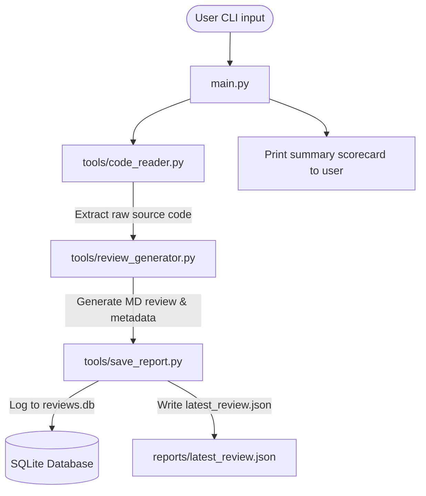
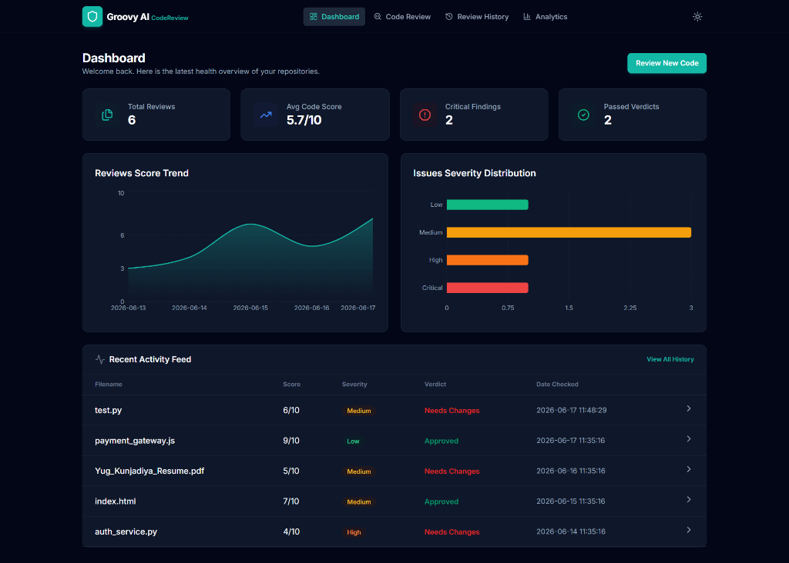
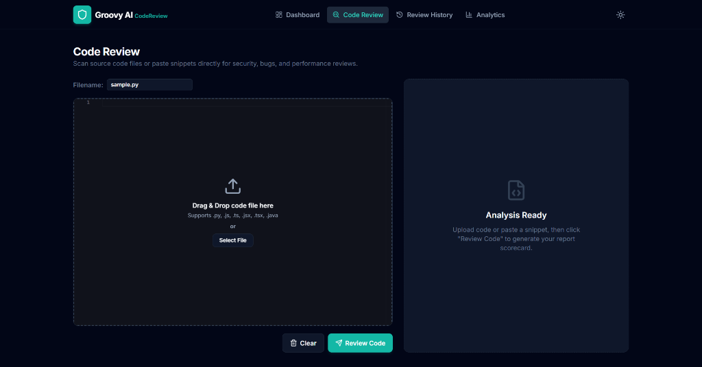
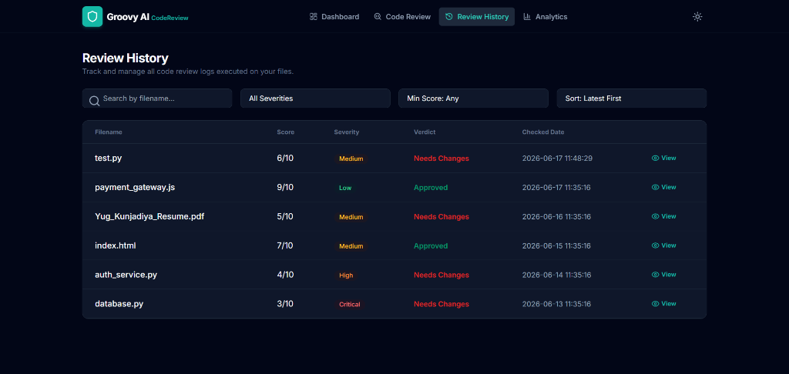
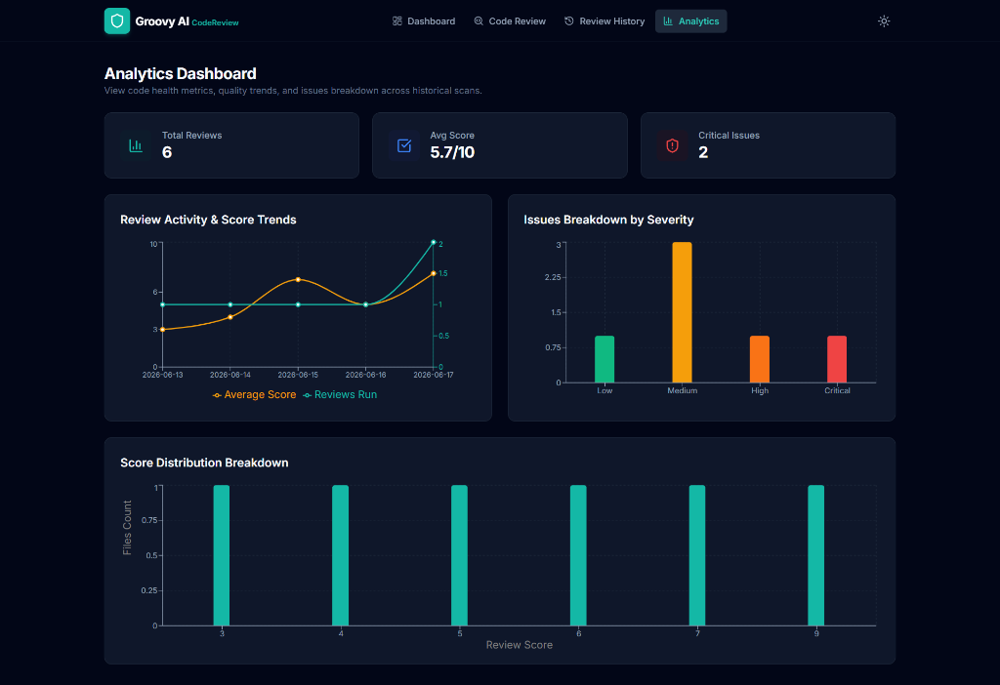

# AI Code Review Agent

An automated command-line agent that acts as a principal developer to analyze source code for bugs, security risks, performance issues, readability, and best practices. Generates full reports, scores, and updates a local database logs history.

---

## Architecture Diagram



---

## Features

* **Multi-Language Analysis:** Automatically detects and reviews `.py`, `.js`, `.ts`, `.jsx`, `.tsx`, and `.java` source code.
* **Deep Review Dimensions:** Analyzes for bugs, SQL injection/XSS flaws, hardcoded credentials, redundant looping, memory usage, styling, and lack of exception handling.
* **Persistent History Logs:** Records every scan date, metadata scorecard, and full report markdown into an SQLite database (`reviews.db`).
* **JSON Export:** Automatically outputs `reports/latest_review.json` for external service consumption.

---

## Setup Instructions

1. **Configure Environment variables:**
   Ensure your `.env` contains your active Groq API Key in the workspace root:
   ```env
   GROQ_API_KEY="your_groq_api_key_here"
   ```

2. **Install Backend & CLI requirements:**
   ```bash
   pip install -r day-15/requirements.txt
   ```

3. **Install Frontend packages:**
   ```bash
   cd day-15/frontend
   npm install
   ```

---

## How To Run

### 1. Interactive Web Dashboard (Recommended)

To run the full modern SaaS dashboard:
* **Start Backend API:**
  ```bash
  python day-15/server.py
  ```
* **Start Frontend Web App:**
  ```bash
  cd day-15/frontend
  npm run dev
  ```
* Open your browser to `http://localhost:5173/` to view the SaaS UI dashboard!

### 2. Command Line CLI

To review a single file from your command line:
```bash
python day-15/main.py day-15/samples/test.py
```

---

## Web Dashboard Features

* **Dashboard Analytics:** High-level overview of files reviewed, average repository score, and severity distributions.
* **Code Review Workspace:** Drop your files or paste code directly, edit inside a dark-themed Monaco Code Editor, and view instant structured scorecards and collapsible reviews.
* **Side-by-Side Code Diff:** Compare original code side-by-side with AI-suggested code fixes.
* **Review History Catalog:** Search, sort, and filter records of all past code reviews.
* **Aggregated Insights:** Interactive charts showing score trends and issues breakdown.

---

## Web Dashboard Preview

### 1. Dashboard Overview


### 2. Code Review Workspace


### 3. Review History


### 4. Analytics Dashboard



