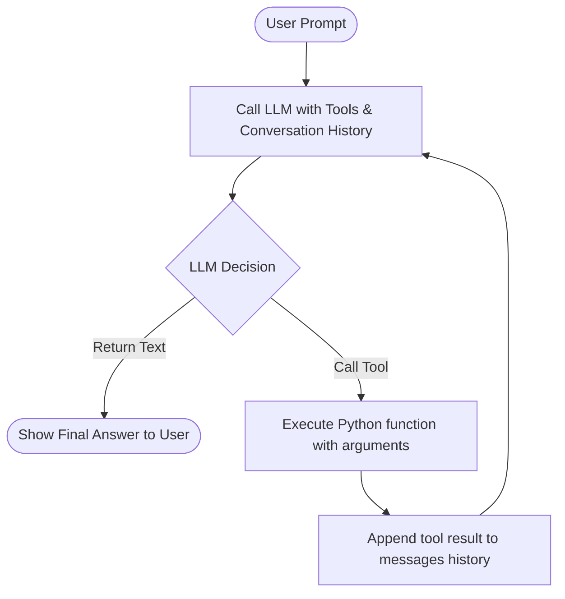

# Day 13: Tool Use, Function Calling, and JSON Schema Design

Welcome to the **Day 13** deliverables. Today's workspace contains an implementation of a **3-Tool Agentic Loop** (Calculator + Web Search + Slack Webhook) driven by an LLM via function calling.

## 1. Tool Specs & JSON Schema Design

To enable an LLM to reliably choose and interact with external systems, we must declare our functions using **JSON Schema**.

A function schema defines:
- The **name** of the tool/function.
- A **description** explaining when the LLM should invoke it.
- A set of **parameters** defined in standard JSON Schema style (e.g. data types, constraints, descriptions, and list of required arguments).

### Example: The Calculator Tool Spec
Here is the JSON schema we designed for our calculator in [tools.py](file:///d:/ai-%20first%20engineer/day-13/tools.py):

```json
{
  "name": "calculate",
  "description": "Perform basic arithmetic calculations (add, subtract, multiply, divide) on two numbers.",
  "parameters": {
    "type": "object",
    "properties": {
      "operation": {
        "type": "string",
        "enum": ["add", "subtract", "multiply", "divide"],
        "description": "The arithmetic operation to perform."
      },
      "a": {
        "type": "number",
        "description": "The first operand (number)."
      },
      "b": {
        "type": "number",
        "description": "The second operand (number)."
      }
    },
    "required": ["operation", "a", "b"]
  }
}
```

---

## 2. Our 3-Tool Agent Stack

The agent is powered by three tools located in [tools.py](file:///d:/ai-%20first%20engineer/day-13/tools.py):

1. **`calculate(operation, a, b)`**: Performs standard operations (`add`, `subtract`, `multiply`, `divide`).
2. **`web_search(query)`**: Scrapes the DuckDuckGo HTML search page to retrieve matching results without requiring any API keys.
3. **`slack_webhook(message, webhook_url)`**: Posts text payload to a Slack Webhook URL. Falls back to a mock/dry-run logging if no webhook is specified.

---

## 3. Agent Execution Flow

The agent's loop is implemented in [agent.py](file:///d:/ai-%20first%20engineer/day-13/agent.py) and behaves as follows:



The system prompt explicitly tells the LLM it can use multiple tools sequentially to complete compound tasks (e.g., look up a number online, compute a result, and send it to Slack).

---

## 4. Run the Code

To run the interactive CLI:

```bash
python day-13/main.py
```

### Try these queries:
1. **Arithmetic:** `What is 9876 multiplied by 543?`
2. **Search:** `Search for the current weather in Tokyo.`
3. **Slack Webhook:** `Send a Slack message saying 'Demoing function calling to my cohort!'`
4. **Combination (Agentic Multi-Step):** `Search for the birth year of Albert Einstein, multiply it by 2, and send the result to Slack.`
